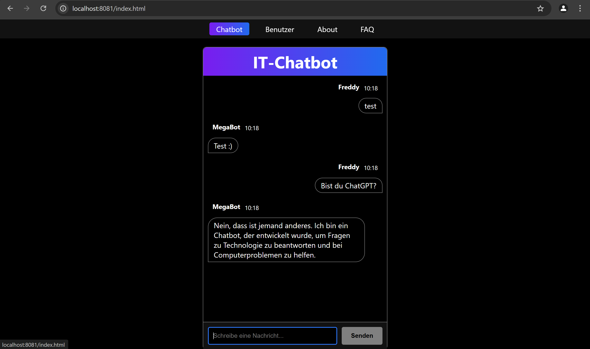

# IT-Support-Chatbot

Ein intelligenter Web-Chatbot, der entwickelt wurde, um Nutzer bei IT-bezogenen Fragen zu unterstützen. Er bietet eine moderne Benutzeroberfläche und einen dynamischen Gesprächsfluss, um präzise und kontextbezogene Lösungen bereitzustellen.

## 📋 Projektübersicht

Der IT-Support-Chatbot wurde entwickelt, um:

- **IT-Lösungen bereitzustellen**: Beantwortung technischer Fragen zu IT-Themen.  
- **Dynamische Dialoge zu ermöglichen**: Vermeidung von Wiederholungen und Nutzung der Gesprächshistorie.  
- **Fallback-Optionen zu bieten**: Kontextbezogene Vorschläge bei unklaren Eingaben anzubieten.  
- **Proaktive Gespräche zu fördern**: Durch Gegenfragen die Konversation effektiv zu lenken.  
- **Eine moderne Oberfläche bereitzustellen**: Ein schlankes, benutzerfreundliches Design für eine professionelle Erfahrung sicherzustellen.  

## 🚀 Zielsetzung

Eine realistische IT-Support-Sitzung mit mindestens 10 Austauschphasen simulieren, damit der Nutzer das Gefühl hat, mit einem echten IT-Experten zu interagieren.

## ⚙️ Voraussetzungen

Um das Projekt zu nutzen oder weiterzuentwickeln, sind folgende Voraussetzungen notwendig:

- **Node.js**  
- **Visual Studio Code**  
- **Google Chrome**  

Außerdem wird grundlegendes Wissen in Webentwicklung (wie in früheren Übungen behandelt) empfohlen.
